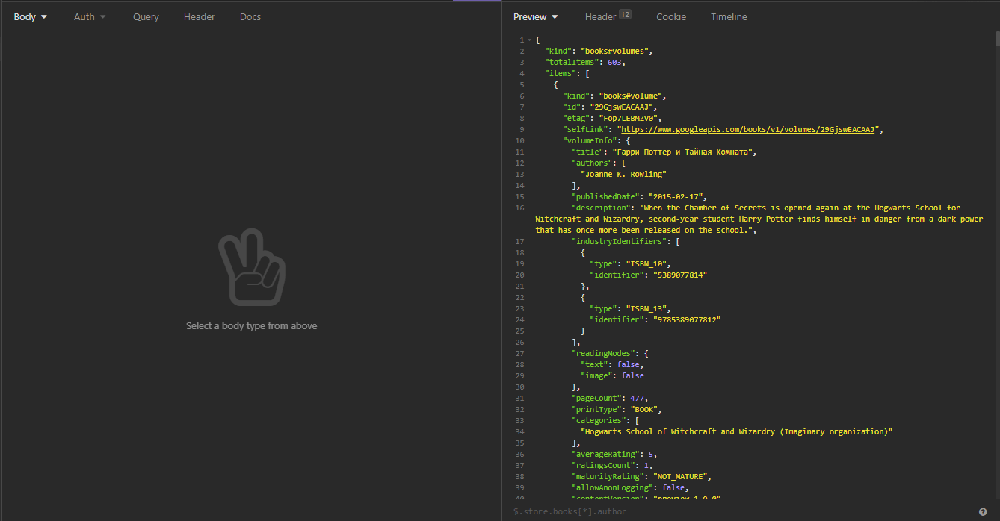

# React Book App
This app was created as test, and doesn't processes some specific cases.

## Development
First of all u need to create .env file in root directory:   
```
REACT_APP_API_KEY = YOUR_KEY
```
Install packages:   
```bash
yarn install
```   
Run react:
```bash
yarn start
```
Build project:
```bash
yarn run build
```

## ShowCase:


## Google magic
Guess u noticed that pages in pagination randomly changes? Welcome to the google magic club:   
   
Stackoverflow: https://stackoverflow.com/questions/7266838/google-books-api-returns-json-with-a-seemingly-wrong-totalitem-value